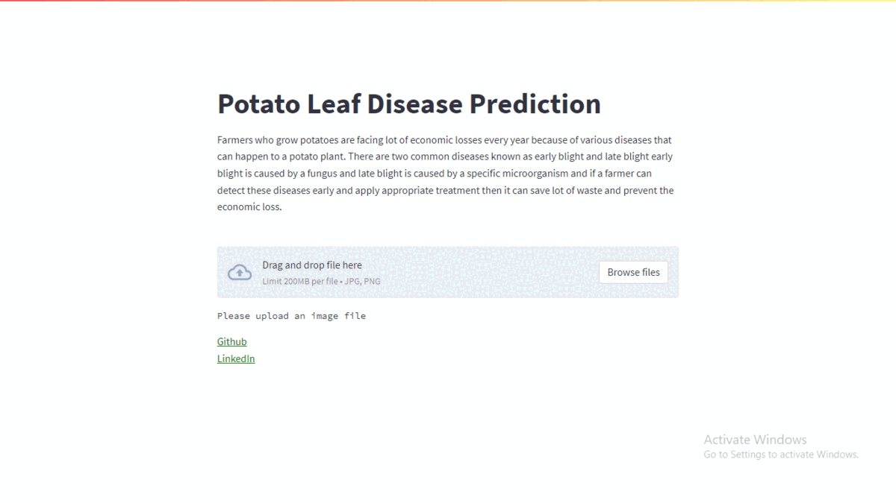
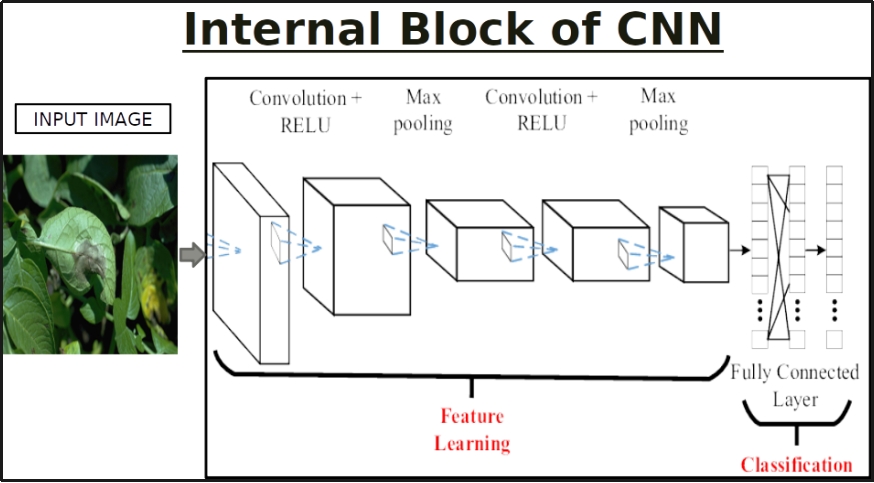

# Potato-Leaf-Disease-Prediction

Farmers who grow potatoes are facing lot of economic losses every year because of various diseases that can happen to a potato plant. There are two common diseases known as early blight and late blight early blight is caused by a fungus and late blight is caused by a specific microorganism and if a farmer can detect these diseases early and apply appropriate treatment then it can save lot of waste and prevent the economic loss.

In this project I develop an end-to-end Deep Learning project in the field of agriculture. I created a simple Image Classification Model that will categorize Potato Leaf Disease using a simple and classic Convolutional Neural Network Architecture and finally use Streamlit to build a web-based application and deploy it on Heroku.

In this project, I am using readymade data that I have got from <a href="https://www.kaggle.com/abdallahalidev/plantvillage-dataset" target="_blank">Kaggle</a>. 

## CNN Architecture

Project Demo: <a href="https://potatoclassification.herokuapp.com/" target="_blank">https://potatoclassification.herokuapp.com/</a>

